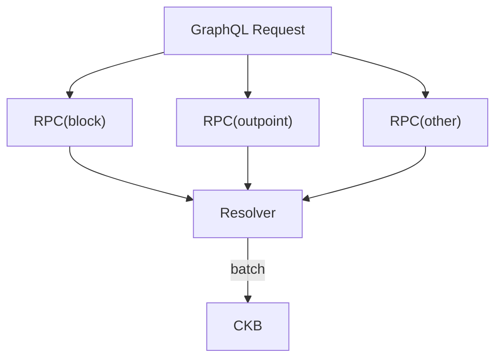

# ckb-urchin

This is a monorepo for a GraphQL(layer, no backend) based explorer for CKB.

## A Glance

```shell
git clone https://github.com/homura/ckb-urchin.git
cd ckb-urchin
pnpm install
pnpm dev
open localhost:4000 # GraphQL playground
open localhost:5173 # CKB explorer
```

## Why I Create This Project

1. Connect CKB dApps with GraphQL to try to make it enrich the dApps ecosystem
2. Knowledge is mesh, I'd been asked the same questions many times, such as "how to find a block of a transaction", "how to find a transaction of a cell", etc.
3. JSON RPC is a hard and unintuitive to connect each piece of data
4. To free from manually scheduling RPC requests, such as batch requests
5. To find a good practice for building custom indexers

## How Does It Work


